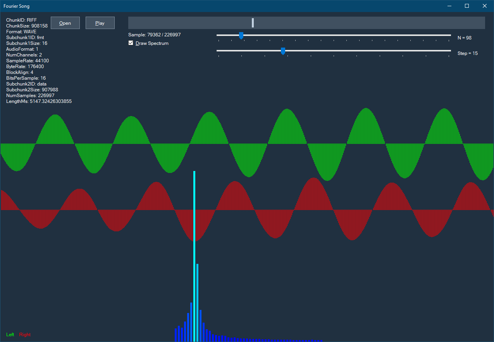

# fourier-audio

Plots the short-time Fourier transform (STFT) for music files, implemented in C# .NET.

This is not meant to be a serious application (where using libraries would be recommended), rather it just a personal test because I like doing signal processing and visualization. :)

Screenshot:

To-do:

* Improve OOP.

* Use FFT rather than DFT.

* Support multiple sliding windows (current is rectangular) as to visualize their convolutional effect on the spectrum.

* Perhaps allow for some auditive interaction in the form of spectrum modification / equalization.
